<!-- pages/lab.md -->

<head>
    
</head>

<table>
  <tbody>
  <tr>
    <td>
<a href="https://robertomartinmartin.com"> Roberto Martín-Martín</a>  Director and PI   
</td>
  </tr>
    <tr>
      <td>
<a href="https://babbatem.github.io/">  Ben Abbatematteo</a>  Post-Doctoral Researcher  
</td>
      <td>
<a href="https://sateeshkumar21.github.io/">  Sateesh Kumar</a>  Ph.D. Student Coadvised with Georgios Pavlakos
</td>
      <td>
<a href="https://jiangbowen0008.github.io/">  Bowen Jiang</a>  Ph.D. Student  
</td>
      <td>
<a href="">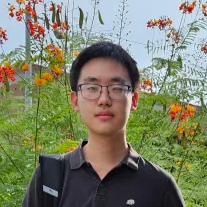  Chris Huang</a>  Ph.D. Student  
</td>
      <td>
<a href="https://shivindass.github.io/">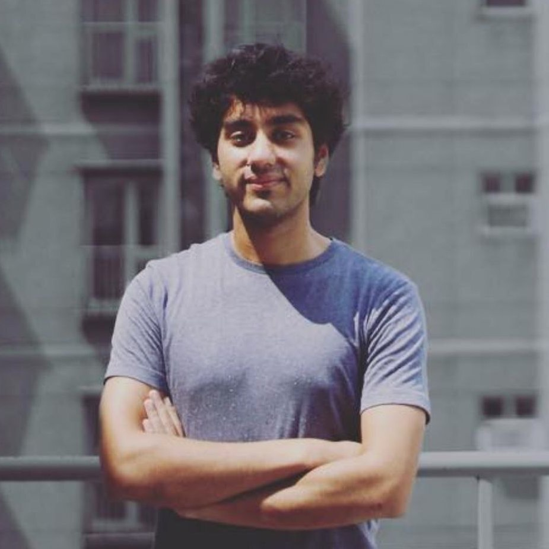  Shivin Dass</a>  Ph.D. Student  
</td>
    </tr>
    <tr>
      <td>
<a href="https://arpitrf.github.io/">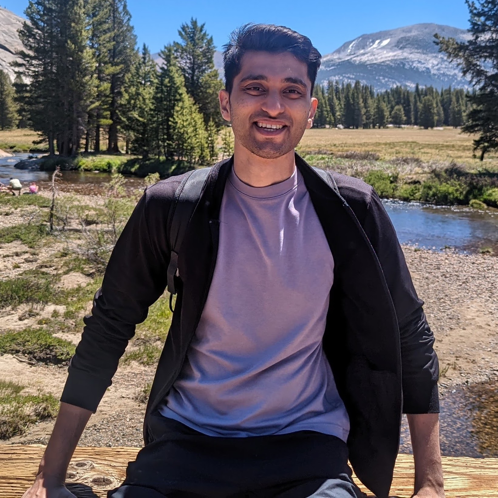  Arpit Bahety</a>  Ph.D. Student  
</td>
      <td>
<a href="https://jiahenghu.github.io/">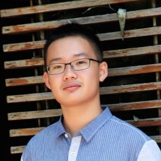  Jiaheng Hu</a>  Ph.D. Student Coadvised with Peter Stone
</td>
      <td>
<a href="https://shahrutav.github.io/"> Rutav Shah</a>  Ph.D. Student Coadvised with Yuke Zhu
</td>
      <td>
<a href="https://scholar.google.com/citations?user=ZzURcb4AAAAJ&hl=en">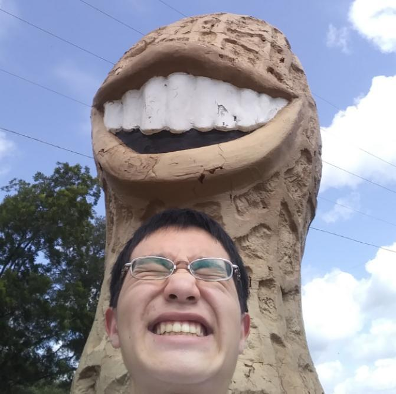 Albert Yu</a>  Ph.D. Student Coadvised with Raymond Mooney
</td>
      <td>
<a href="https://github.com/rayruchira">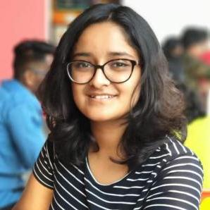 Ruchira Ray</a>  Master's student
</td>
    </tr>
      <td>
<a href="https://www.linkedin.com/in/addiefoote/">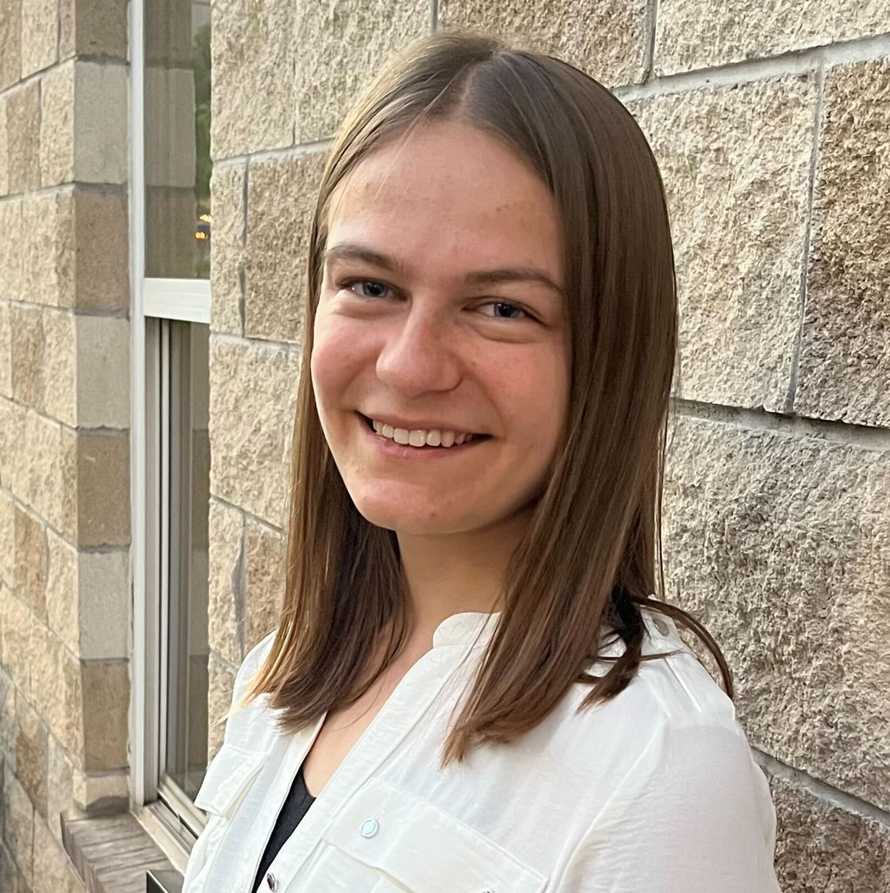 Addie Foote</a>  Undergraduate student  
</td>
      <td>
<a href="https://www.linkedin.com/in/luca-macesanu/"> Luca Macesanu </a>  Undergraduate student  
</td>
      <td>
<a href="https://www.linkedin.com/in/imsamik/">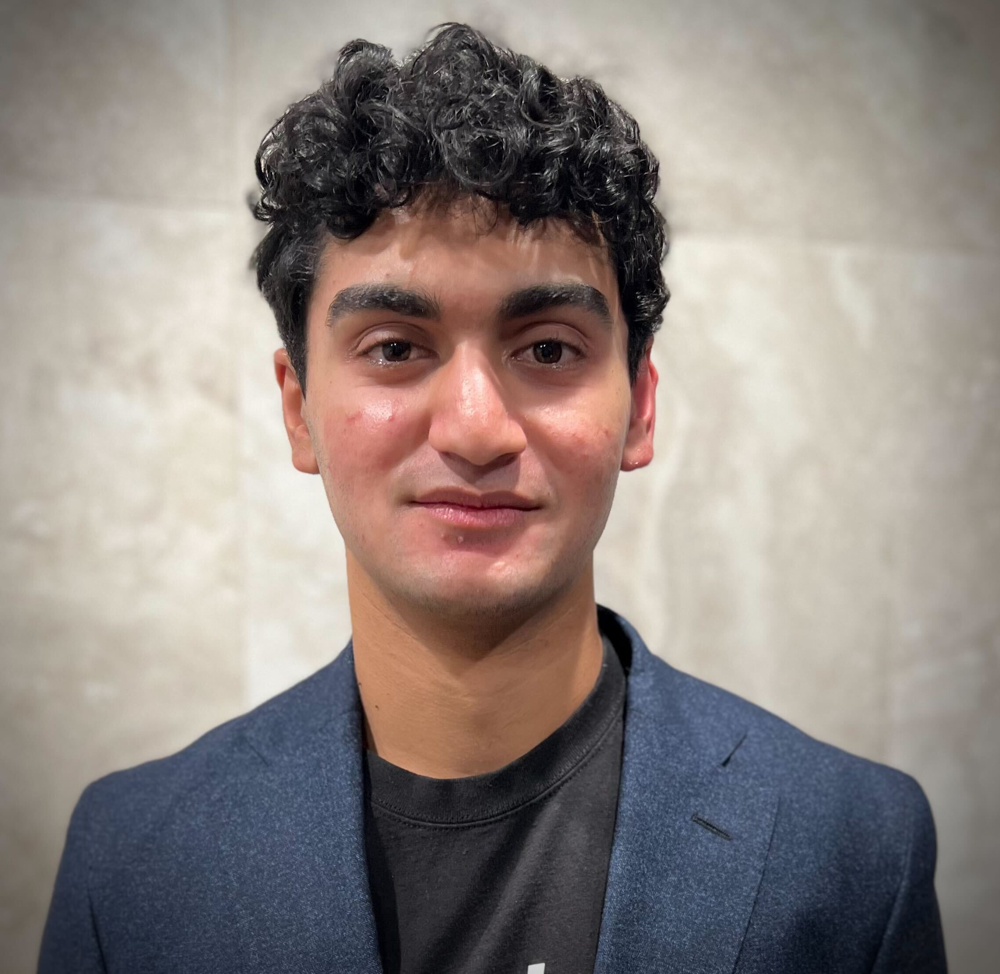 Samik Singh</a>  Undergraduate student  
</td>
    <tr>
    </tr>
    <!--   -->
    <tr style="height:2em">
      <td></td>
    </tr>
    <tr>
      <td style="font-size:1.5em">
          Collaborators
      </td>
    </tr>
    <tr>
      <td>
<a href="https://reneu.robotics.utexas.edu/members/gu-cheol-jeong">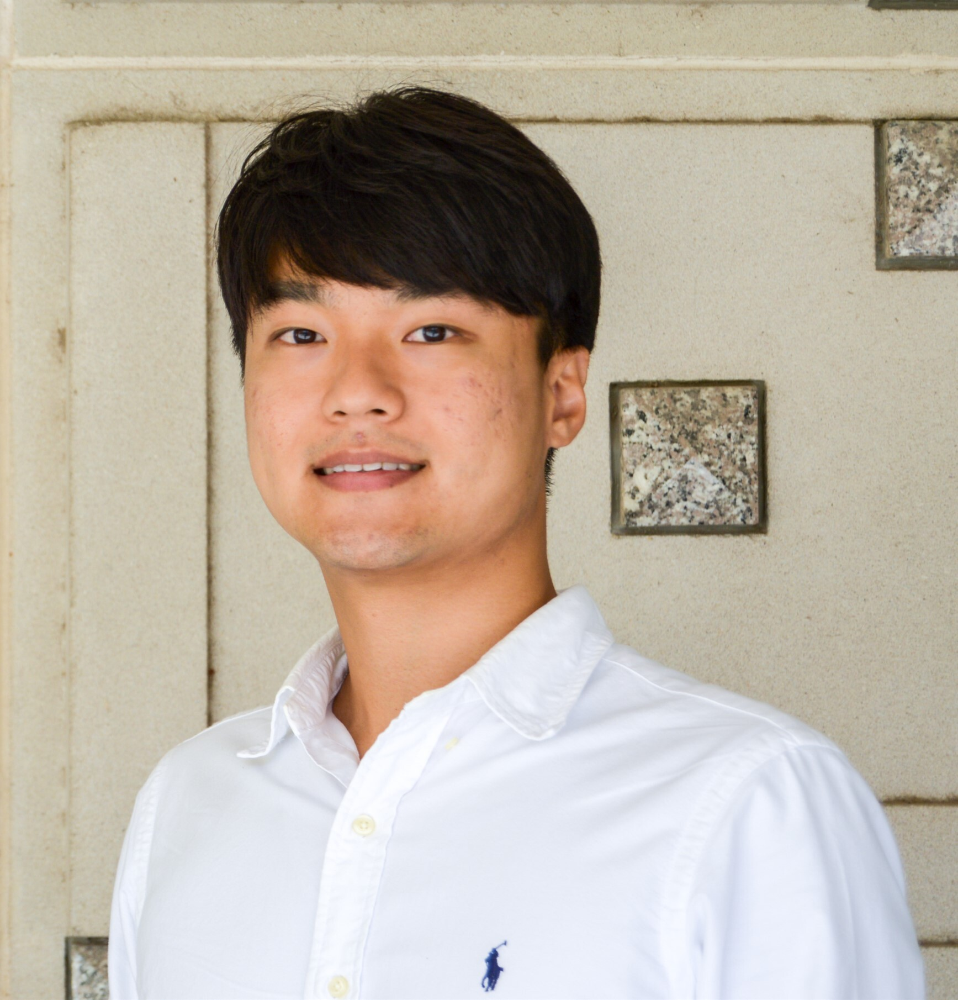 Gu-Cheol Jeong</a>  Ph.D. Student  
</td>
    </tr>
    <tr>
      <td style="font-size:1.5em">
          Robots
      </td>
    </tr>
    <tr>
      <td>
<a href="https://blog.pal-robotics.com/tiago-omni-bi-manual-omnidirectional-robot/">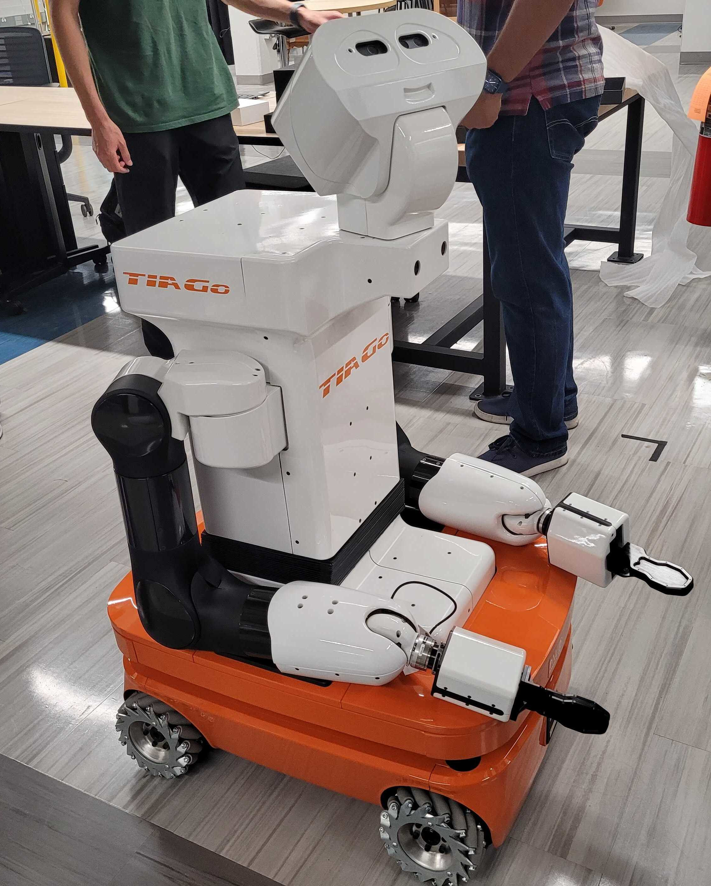 Mario</a>  Mobile Manipulator  
</td>
      <td>
<a href="https://www.franka.de/research/"> Luigi</a>  Robot Arm  
</td>
      <td>
<a href="https://www.franka.de/research/">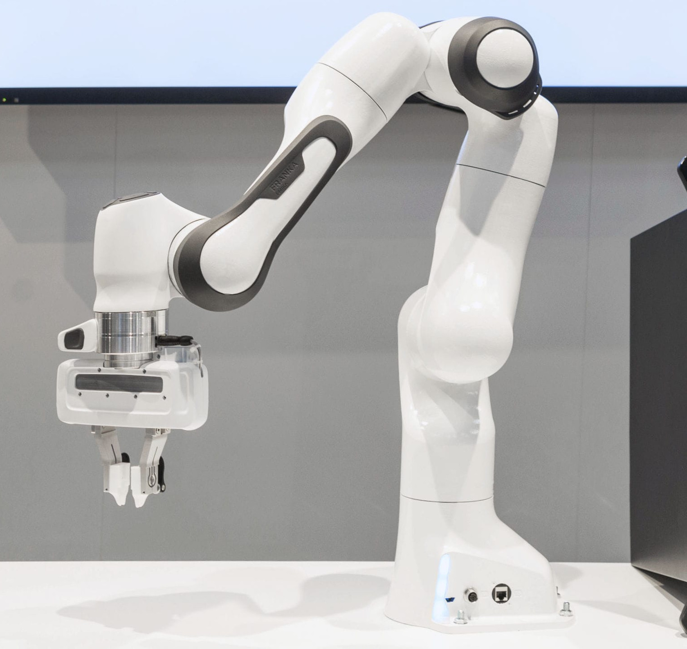 Bowser</a>  Robot Arm  
</td>
    </tr>
    <tr>
      <td style="font-size:1.5em">
          Alumni
      </td>
    </tr>
    <!--   -->
    <tr>
      <td> Student </td>
      <td> Class </td>
      <td> After Graduation </td>
    </tr>
    <tr>
      <td><a href="">Caleb Chalmers</a></td>
      <td>Math UG '25</td>
      <td></td>
    </tr>
    <tr>
    </tr>
    <tr>
    </tr>
  </tbody>
</table>

  

To join the lab, fill in [this form](https://docs.google.com/forms/d/e/1FAIpQLSffvYGQ74fz2c-GvBfTGbuXGxupA0Y8Iy4s88UfVu7Gfb1c1A/viewform) and state clearly if you are an UG/MSc/PhD from UT, or a prospective visitor. 